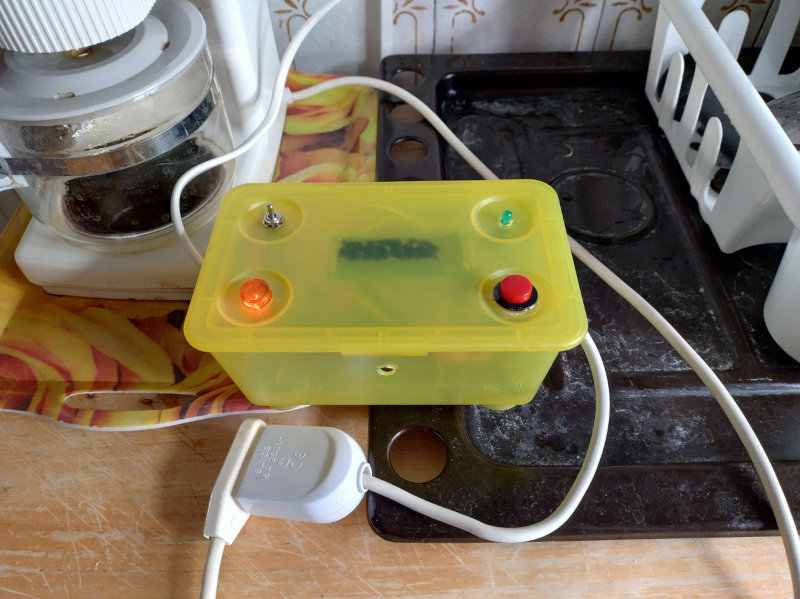
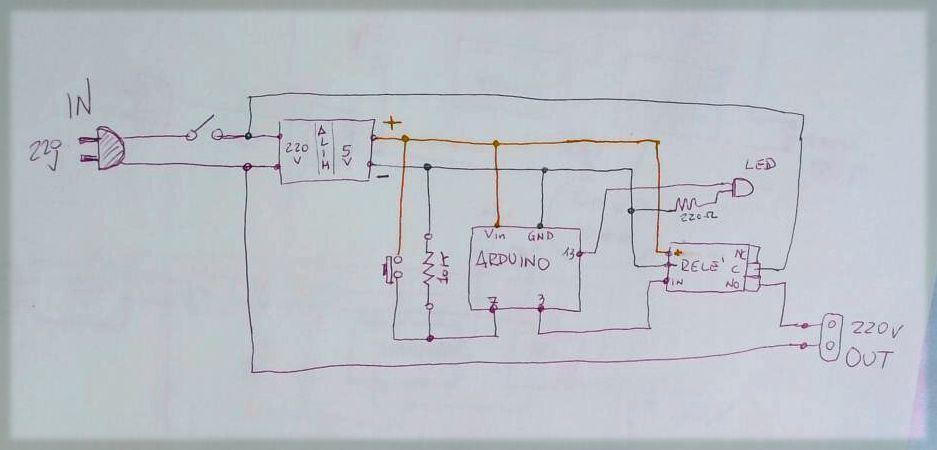

# Timed-power-socket
A smart socket that when activated by a button would turn off after four minutes.

I needed this smart socket to avoid leaving the American coffee machine on.

## Description

The project is based on **Arudino** controller who manages timer and relay.

The coffee machine connects to the timed outlet, which in turn connects to the home electrical outlet. So, it is the smart outlet that provides the power to the coffee maker through a push button.

When the push-button is pressed, the relay provides output voltage to the coffee machine. At the same time, the four-minute timer starts, after which the relay returns to the off position and the coffè machine is no more powered. A green led indicate the status of the output: when is on the coffè machine is powered; when is off the coffè machine is unpowered

## Components
1x Arudino controller
1x 220V to 5V Mini Power Supply Module
1x 1or2 Channel DC 5V Relay Module
1x green Led
1x 220 Ohm resistor
1x 10K Ohm resistor
1x switch
1x push button
socket plug, 1x male 1x female
wires

## Code

